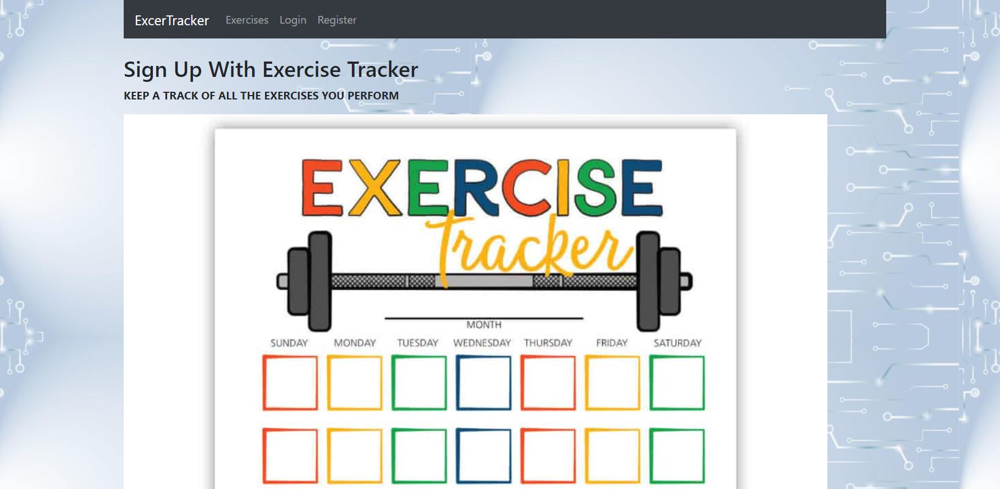

<h1> ExerciseTracker | MERN </h1>

The project is about the keeping the track of about how much time we invest in exercising and keeping yourself fit.

<h2> Built using </h2>
<h3> Front-end </h3>
<ul> ReactJS - Frontend framework </ul>
<ul> Rest API - For state management </ul>
 <ul> React Router - For general routing & navigation </ul>
  <ul> Material-UI with Bootstrap - UI library </ul> 

<h3>Back-end </h3>
<ul>Node.js - Runtime environment for JS </ul>
<ul>Express.js - Node.js framework, makes process of building APIs easier & faster </ul>
<ul>MongoDB Cloud Atlas - Database to store document-based data </ul>
<ul>JSON Web Token - A standard to secure/authenticate HTTP requests </ul>
<ul>Dotenv - To load environment variables from a .env file </ul>

<h2> Features </h2>
<ul>Create New User </ul>
<ul>Add Username,Description,Duration and 	Date </ul>
<ul>Add/update/delete entries </ul>
<ul>Click on exercises to view all entries </ul>
<ul>Responsive UI for all screens </ul>

